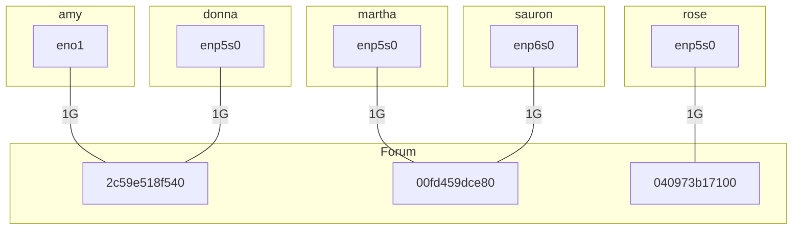

```mermaid
  graph TD
      amy.eno1["eno1"]-- 1G ---Forum.2c59e518f540["2c59e518f540"]
      donna.enp5s0["enp5s0"]-- 1G ---Forum.2c59e518f540["2c59e518f540"]
      martha.enp5s0["enp5s0"]-- 1G ---Forum.00fd459dce80["00fd459dce80"]
      rose.enp5s0["enp5s0"]-- 1G ---Forum.040973b17100["040973b17100"]
      sauron.enp6s0["enp6s0"]-- 1G ---Forum.00fd459dce80["00fd459dce80"]
      subgraph Forum
      Forum.00fd459dce80["00fd459dce80"]
      Forum.040973b17100["040973b17100"]
      Forum.2c59e518f540["2c59e518f540"]
      end
      subgraph sauron
      sauron.enp6s0["enp6s0"]
      end
      subgraph donna
      donna.enp5s0["enp5s0"]
      end
      subgraph amy
      amy.eno1["eno1"]
      end
      subgraph rose
      rose.enp5s0["enp5s0"]
      end
      subgraph martha
      martha.enp5s0["enp5s0"]
      end
      click sauron.enp6s0 "https://github.com/TUM-DSE/doctor-cluster-config/blob/master/docs/edinburgh/sauron.md" "sauron"
      click donna.enp5s0 "https://github.com/TUM-DSE/doctor-cluster-config/blob/master/docs/edinburgh/donna.md" "donna"
      click amy.eno1 "https://github.com/TUM-DSE/doctor-cluster-config/blob/master/docs/edinburgh/amy.md" "amy"
      click rose.enp5s0 "https://github.com/TUM-DSE/doctor-cluster-config/blob/master/docs/edinburgh/rose.md" "rose"
      click martha.enp5s0 "https://github.com/TUM-DSE/doctor-cluster-config/blob/master/docs/edinburgh/martha.md" "martha"
```
