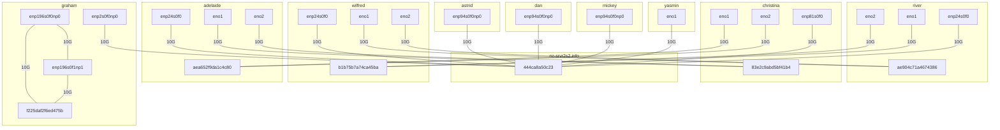

```mermaid
  graph TD
      adelaide.eno1["eno1"]-- 10G ---christina.83e2c9abd5bf41b4["83e2c9abd5bf41b4"]
      adelaide.eno2["eno2"]-- 10G ---christina.83e2c9abd5bf41b4["83e2c9abd5bf41b4"]
      adelaide.enp24s0f0["enp24s0f0"]-- 10G ---nz-srvr2s2.info.444ca8a50c23["444ca8a50c23"]
      astrid.enp94s0f0np0["enp94s0f0np0"]-- 10G ---nz-srvr2s2.info.444ca8a50c23["444ca8a50c23"]
      christina.eno1["eno1"]-- 10G ---adelaide.aea652f9da1c4c80["aea652f9da1c4c80"]
      christina.eno2["eno2"]-- 10G ---adelaide.aea652f9da1c4c80["aea652f9da1c4c80"]
      christina.enp81s0f0["enp81s0f0"]-- 10G ---nz-srvr2s2.info.444ca8a50c23["444ca8a50c23"]
      dan.enp94s0f0np0["enp94s0f0np0"]-- 10G ---nz-srvr2s2.info.444ca8a50c23["444ca8a50c23"]
      graham.enp2s0f0np0["enp2s0f0np0"]-- 10G ---nz-srvr2s2.info.444ca8a50c23["444ca8a50c23"]
      graham.enp196s0f0np0["enp196s0f0np0"]-- 10G ---graham.enp196s0f1np1["enp196s0f1np1"]
      graham.enp196s0f0np0["enp196s0f0np0"]-- 10G ---graham.f225daf2f6ed475b["f225daf2f6ed475b"]
      graham.enp196s0f1np1["enp196s0f1np1"]-- 10G ---graham.f225daf2f6ed475b["f225daf2f6ed475b"]
      mickey.enp94s0f0np0["enp94s0f0np0"]-- 10G ---nz-srvr2s2.info.444ca8a50c23["444ca8a50c23"]
      river.enp24s0f0["enp24s0f0"]-- 10G ---nz-srvr2s2.info.444ca8a50c23["444ca8a50c23"]
      river.eno2["eno2"]-- 10G ---wilfred.b1b75b7a74ca45ba["b1b75b7a74ca45ba"]
      river.eno1["eno1"]-- 10G ---wilfred.b1b75b7a74ca45ba["b1b75b7a74ca45ba"]
      wilfred.eno1["eno1"]-- 10G ---river.ae904c71a4674386["ae904c71a4674386"]
      wilfred.eno2["eno2"]-- 10G ---river.ae904c71a4674386["ae904c71a4674386"]
      wilfred.enp24s0f0["enp24s0f0"]-- 10G ---nz-srvr2s2.info.444ca8a50c23["444ca8a50c23"]
      yasmin.eno1["eno1"]-- 10G ---nz-srvr2s2.info.444ca8a50c23["444ca8a50c23"]
      subgraph river
      river.ae904c71a4674386["ae904c71a4674386"]
      river.eno1["eno1"]
      river.eno2["eno2"]
      river.enp24s0f0["enp24s0f0"]
      end
      subgraph astrid
      astrid.enp94s0f0np0["enp94s0f0np0"]
      end
      subgraph yasmin
      yasmin.eno1["eno1"]
      end
      subgraph christina
      christina.83e2c9abd5bf41b4["83e2c9abd5bf41b4"]
      christina.eno1["eno1"]
      christina.eno2["eno2"]
      christina.enp81s0f0["enp81s0f0"]
      end
      subgraph mickey
      mickey.enp94s0f0np0["enp94s0f0np0"]
      end
      subgraph nz-srvr2s2.info
      nz-srvr2s2.info.444ca8a50c23["444ca8a50c23"]
      end
      subgraph dan
      dan.enp94s0f0np0["enp94s0f0np0"]
      end
      subgraph wilfred
      wilfred.b1b75b7a74ca45ba["b1b75b7a74ca45ba"]
      wilfred.eno1["eno1"]
      wilfred.eno2["eno2"]
      wilfred.enp24s0f0["enp24s0f0"]
      end
      subgraph adelaide
      adelaide.aea652f9da1c4c80["aea652f9da1c4c80"]
      adelaide.eno1["eno1"]
      adelaide.eno2["eno2"]
      adelaide.enp24s0f0["enp24s0f0"]
      end
      subgraph graham
      graham.enp196s0f0np0["enp196s0f0np0"]
      graham.enp196s0f1np1["enp196s0f1np1"]
      graham.enp2s0f0np0["enp2s0f0np0"]
      graham.f225daf2f6ed475b["f225daf2f6ed475b"]
      end
      click river.ae904c71a4674386 "https://github.com/TUM-DSE/doctor-cluster-config/blob/master/docs/hosts/river.md" "river"
      click river.eno1 "https://github.com/TUM-DSE/doctor-cluster-config/blob/master/docs/hosts/river.md" "river"
      click river.eno2 "https://github.com/TUM-DSE/doctor-cluster-config/blob/master/docs/hosts/river.md" "river"
      click river.enp24s0f0 "https://github.com/TUM-DSE/doctor-cluster-config/blob/master/docs/hosts/river.md" "river"
      click astrid.enp94s0f0np0 "https://github.com/TUM-DSE/doctor-cluster-config/blob/master/docs/hosts/astrid.md" "astrid"
      click yasmin.eno1 "https://github.com/TUM-DSE/doctor-cluster-config/blob/master/docs/hosts/yasmin.md" "yasmin"
      click christina.83e2c9abd5bf41b4 "https://github.com/TUM-DSE/doctor-cluster-config/blob/master/docs/hosts/christina.md" "christina"
      click christina.eno1 "https://github.com/TUM-DSE/doctor-cluster-config/blob/master/docs/hosts/christina.md" "christina"
      click christina.eno2 "https://github.com/TUM-DSE/doctor-cluster-config/blob/master/docs/hosts/christina.md" "christina"
      click christina.enp81s0f0 "https://github.com/TUM-DSE/doctor-cluster-config/blob/master/docs/hosts/christina.md" "christina"
      click mickey.enp94s0f0np0 "https://github.com/TUM-DSE/doctor-cluster-config/blob/master/docs/hosts/mickey.md" "mickey"
      click dan.enp94s0f0np0 "https://github.com/TUM-DSE/doctor-cluster-config/blob/master/docs/hosts/dan.md" "dan"
      click wilfred.b1b75b7a74ca45ba "https://github.com/TUM-DSE/doctor-cluster-config/blob/master/docs/hosts/wilfred.md" "wilfred"
      click wilfred.eno1 "https://github.com/TUM-DSE/doctor-cluster-config/blob/master/docs/hosts/wilfred.md" "wilfred"
      click wilfred.eno2 "https://github.com/TUM-DSE/doctor-cluster-config/blob/master/docs/hosts/wilfred.md" "wilfred"
      click wilfred.enp24s0f0 "https://github.com/TUM-DSE/doctor-cluster-config/blob/master/docs/hosts/wilfred.md" "wilfred"
      click adelaide.aea652f9da1c4c80 "https://github.com/TUM-DSE/doctor-cluster-config/blob/master/docs/hosts/adelaide.md" "adelaide"
      click adelaide.eno1 "https://github.com/TUM-DSE/doctor-cluster-config/blob/master/docs/hosts/adelaide.md" "adelaide"
      click adelaide.eno2 "https://github.com/TUM-DSE/doctor-cluster-config/blob/master/docs/hosts/adelaide.md" "adelaide"
      click adelaide.enp24s0f0 "https://github.com/TUM-DSE/doctor-cluster-config/blob/master/docs/hosts/adelaide.md" "adelaide"
      click graham.enp196s0f0np0 "https://github.com/TUM-DSE/doctor-cluster-config/blob/master/docs/hosts/graham.md" "graham"
      click graham.enp196s0f1np1 "https://github.com/TUM-DSE/doctor-cluster-config/blob/master/docs/hosts/graham.md" "graham"
      click graham.enp2s0f0np0 "https://github.com/TUM-DSE/doctor-cluster-config/blob/master/docs/hosts/graham.md" "graham"
      click graham.f225daf2f6ed475b "https://github.com/TUM-DSE/doctor-cluster-config/blob/master/docs/hosts/graham.md" "graham"
```
