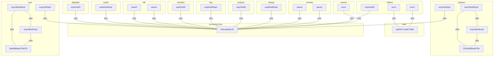

```mermaid
  graph TD
      adelaide.enp24s0f0["enp24s0f0"]-- 10G ---nz-srvr2s2.info.444ca8a50c23["444ca8a50c23"]
      astrid.enp94s0f0np0["enp94s0f0np0"]-- 10G ---nz-srvr2s2.info.444ca8a50c23["444ca8a50c23"]
      bill.slave0["slave0"]-- 10G ---nz-srvr2s2.info.444ca8a50c23["444ca8a50c23"]
      bill.slave1["slave1"]-- 10G ---nz-srvr2s2.info.444ca8a50c23["444ca8a50c23"]
      christina.enp81s0f0["enp81s0f0"]-- 10G ---nz-srvr2s2.info.444ca8a50c23["444ca8a50c23"]
      dan.enp94s0f0np0["enp94s0f0np0"]-- 10G ---nz-srvr2s2.info.444ca8a50c23["444ca8a50c23"]
      graham.enp2s0f0np0["enp2s0f0np0"]-- 10G ---nz-srvr2s2.info.444ca8a50c23["444ca8a50c23"]
      graham.enp196s0f0np0["enp196s0f0np0"]-- 10G ---graham.enp196s0f1np1["enp196s0f1np1"]
      graham.enp196s0f0np0["enp196s0f0np0"]-- 10G ---graham.f225daf2f6ed475b["f225daf2f6ed475b"]
      graham.enp196s0f1np1["enp196s0f1np1"]-- 10G ---graham.f225daf2f6ed475b["f225daf2f6ed475b"]
      jackson.enp24s0f0["enp24s0f0"]-- 10G ---nz-srvr2s2.info.444ca8a50c23["444ca8a50c23"]
      mickey.enp94s0f0np0["enp94s0f0np0"]-- 10G ---nz-srvr2s2.info.444ca8a50c23["444ca8a50c23"]
      nardole.slave0["slave0"]-- 10G ---nz-srvr2s2.info.444ca8a50c23["444ca8a50c23"]
      nardole.slave1["slave1"]-- 10G ---nz-srvr2s2.info.444ca8a50c23["444ca8a50c23"]
      ryan.enp2s0f0np0["enp2s0f0np0"]-- 10G ---nz-srvr2s2.info.444ca8a50c23["444ca8a50c23"]
      ryan.enp196s0f0np0["enp196s0f0np0"]-- 10G ---ryan.enp196s0f1np1["enp196s0f1np1"]
      ryan.enp196s0f0np0["enp196s0f0np0"]-- 10G ---ryan.3de698baa3784079["3de698baa3784079"]
      ryan.enp196s0f1np1["enp196s0f1np1"]-- 10G ---ryan.3de698baa3784079["3de698baa3784079"]
      wilfred.eno1["eno1"]-- 10G ---river.ae904c71a4674386["ae904c71a4674386"]
      wilfred.eno2["eno2"]-- 10G ---river.ae904c71a4674386["ae904c71a4674386"]
      wilfred.enp24s0f0["enp24s0f0"]-- 10G ---nz-srvr2s2.info.444ca8a50c23["444ca8a50c23"]
      yasmin.eno1["eno1"]-- 10G ---nz-srvr2s2.info.444ca8a50c23["444ca8a50c23"]
      subgraph river
      river.ae904c71a4674386["ae904c71a4674386"]
      end
      subgraph astrid
      astrid.enp94s0f0np0["enp94s0f0np0"]
      end
      subgraph bill
      bill.slave0["slave0"]
      bill.slave1["slave1"]
      end
      subgraph yasmin
      yasmin.eno1["eno1"]
      end
      subgraph christina
      christina.enp81s0f0["enp81s0f0"]
      end
      subgraph mickey
      mickey.enp94s0f0np0["enp94s0f0np0"]
      end
      subgraph jackson
      jackson.enp24s0f0["enp24s0f0"]
      end
      subgraph nz-srvr2s2.info
      nz-srvr2s2.info.444ca8a50c23["444ca8a50c23"]
      end
      subgraph dan
      dan.enp94s0f0np0["enp94s0f0np0"]
      end
      subgraph wilfred
      wilfred.eno1["eno1"]
      wilfred.eno2["eno2"]
      wilfred.enp24s0f0["enp24s0f0"]
      end
      subgraph adelaide
      adelaide.enp24s0f0["enp24s0f0"]
      end
      subgraph graham
      graham.enp196s0f0np0["enp196s0f0np0"]
      graham.enp196s0f1np1["enp196s0f1np1"]
      graham.enp2s0f0np0["enp2s0f0np0"]
      graham.f225daf2f6ed475b["f225daf2f6ed475b"]
      end
      subgraph nardole
      nardole.slave0["slave0"]
      nardole.slave1["slave1"]
      end
      subgraph ryan
      ryan.3de698baa3784079["3de698baa3784079"]
      ryan.enp196s0f0np0["enp196s0f0np0"]
      ryan.enp196s0f1np1["enp196s0f1np1"]
      ryan.enp2s0f0np0["enp2s0f0np0"]
      end
      click river.ae904c71a4674386 "https://github.com/TUM-DSE/doctor-cluster-config/blob/master/docs/hosts/river.md" "river"
      click astrid.enp94s0f0np0 "https://github.com/TUM-DSE/doctor-cluster-config/blob/master/docs/hosts/astrid.md" "astrid"
      click bill.slave0 "https://github.com/TUM-DSE/doctor-cluster-config/blob/master/docs/hosts/bill.md" "bill"
      click bill.slave1 "https://github.com/TUM-DSE/doctor-cluster-config/blob/master/docs/hosts/bill.md" "bill"
      click yasmin.eno1 "https://github.com/TUM-DSE/doctor-cluster-config/blob/master/docs/hosts/yasmin.md" "yasmin"
      click christina.enp81s0f0 "https://github.com/TUM-DSE/doctor-cluster-config/blob/master/docs/hosts/christina.md" "christina"
      click mickey.enp94s0f0np0 "https://github.com/TUM-DSE/doctor-cluster-config/blob/master/docs/hosts/mickey.md" "mickey"
      click jackson.enp24s0f0 "https://github.com/TUM-DSE/doctor-cluster-config/blob/master/docs/hosts/jackson.md" "jackson"
      click dan.enp94s0f0np0 "https://github.com/TUM-DSE/doctor-cluster-config/blob/master/docs/hosts/dan.md" "dan"
      click wilfred.eno1 "https://github.com/TUM-DSE/doctor-cluster-config/blob/master/docs/hosts/wilfred.md" "wilfred"
      click wilfred.eno2 "https://github.com/TUM-DSE/doctor-cluster-config/blob/master/docs/hosts/wilfred.md" "wilfred"
      click wilfred.enp24s0f0 "https://github.com/TUM-DSE/doctor-cluster-config/blob/master/docs/hosts/wilfred.md" "wilfred"
      click adelaide.enp24s0f0 "https://github.com/TUM-DSE/doctor-cluster-config/blob/master/docs/hosts/adelaide.md" "adelaide"
      click graham.enp196s0f0np0 "https://github.com/TUM-DSE/doctor-cluster-config/blob/master/docs/hosts/graham.md" "graham"
      click graham.enp196s0f1np1 "https://github.com/TUM-DSE/doctor-cluster-config/blob/master/docs/hosts/graham.md" "graham"
      click graham.enp2s0f0np0 "https://github.com/TUM-DSE/doctor-cluster-config/blob/master/docs/hosts/graham.md" "graham"
      click graham.f225daf2f6ed475b "https://github.com/TUM-DSE/doctor-cluster-config/blob/master/docs/hosts/graham.md" "graham"
      click nardole.slave0 "https://github.com/TUM-DSE/doctor-cluster-config/blob/master/docs/hosts/nardole.md" "nardole"
      click nardole.slave1 "https://github.com/TUM-DSE/doctor-cluster-config/blob/master/docs/hosts/nardole.md" "nardole"
      click ryan.3de698baa3784079 "https://github.com/TUM-DSE/doctor-cluster-config/blob/master/docs/hosts/ryan.md" "ryan"
      click ryan.enp196s0f0np0 "https://github.com/TUM-DSE/doctor-cluster-config/blob/master/docs/hosts/ryan.md" "ryan"
      click ryan.enp196s0f1np1 "https://github.com/TUM-DSE/doctor-cluster-config/blob/master/docs/hosts/ryan.md" "ryan"
      click ryan.enp2s0f0np0 "https://github.com/TUM-DSE/doctor-cluster-config/blob/master/docs/hosts/ryan.md" "ryan"
```
